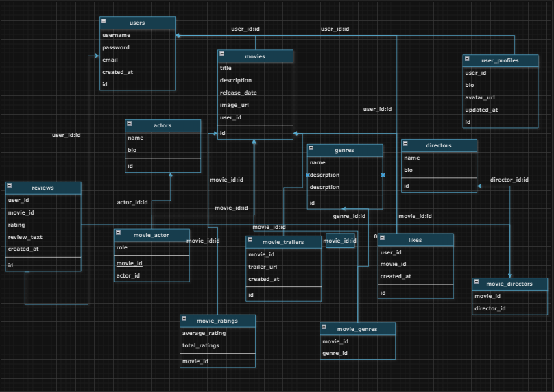

# Documentation for the Project

## 📋 Project Overview
This project is a web-based application that includes functionalities for user authentication (Login & Registration) and provides information about the top-rated films on Kinopoisk. The project features several pages including a Home page, About page, Contact page, and Movies list.

### Pages Included:
- **index.html**: The main page for user authentication.
- **about.html**: Contains details about the website and its purpose.
- **home.html**: Welcome page for authenticated users.
- **contact.html**: Provides contact information and social media links.
- **movies.html**: Allows users to view and add movies to a list.

## 📂 Folder Structure
```
project-folder/
|-- index.html
|-- about.html
|-- home.html
|-- contact.html
|-- movies.html
|-- style.css
|-- auth.css
|-- script.js
|-- movies.js
|-- assets/
|   |-- images/
|       |-- kk.png
|-- README.md
|-- docker-compose.yaml
```

## 🛠 Features
- **Authentication System**: 
  - Login and registration forms with validation.
  - Remember Me and Forgot Password options.

- **Interactive UI**: 
  - Responsive design using CSS.
  - Dynamic forms for adding and viewing movies.

- **Content Presentation**: 
  - Information about top-rated movies.
  - Contact details and social media links.

## 🖼 Example of the interface



## ⛁ Database Design
The project includes a relational database to store information about users, movies, genres, directors, actors, reviews, and their relationships.

### Tables

#### Users Table
```sql
CREATE TABLE users (
    id INT AUTO_INCREMENT PRIMARY KEY,      -- User identifier
    username VARCHAR(100) NOT NULL UNIQUE,  -- User's login, unique
    password VARCHAR(255) NOT NULL,         -- Encrypted password
    email VARCHAR(100) NOT NULL UNIQUE,     -- User's email, unique
    created_at TIMESTAMP DEFAULT CURRENT_TIMESTAMP -- Record creation time
);
```

#### Movies Table
```sql
CREATE TABLE movies (
    id INT AUTO_INCREMENT PRIMARY KEY,      -- Movie identifier
    title VARCHAR(255) NOT NULL,            -- Movie title
    description TEXT,                       -- Movie description
    release_date DATE,                      -- Movie release date
    image_url VARCHAR(255)                  -- Movie image URL
);

-- Modifications:
ALTER TABLE movies MODIFY image_url TEXT;
ALTER TABLE movies ADD user_id INT;
ALTER TABLE movies ADD FOREIGN KEY (user_id) REFERENCES users(id) ON DELETE CASCADE;
```

#### Likes Table
```sql
CREATE TABLE likes (
    id INT AUTO_INCREMENT PRIMARY KEY,       -- Like identifier
    user_id INT NOT NULL,                    -- User identifier
    movie_id INT NOT NULL,                   -- Movie identifier
    created_at TIMESTAMP DEFAULT CURRENT_TIMESTAMP,  -- Like creation time
    FOREIGN KEY (user_id) REFERENCES users(id) ON DELETE CASCADE,  -- Link to users table
    FOREIGN KEY (movie_id) REFERENCES movies(id) ON DELETE CASCADE -- Link to movies table
);
```

#### Genres Table
```sql
CREATE TABLE genres (
    id INT AUTO_INCREMENT PRIMARY KEY,        -- Genre identifier
    name VARCHAR(100) NOT NULL UNIQUE,         -- Genre name
    description TEXT                           -- Genre description
);
```

#### Movie Genres Table (Many-to-Many Relationship)
```sql
CREATE TABLE movie_genres (
    movie_id INT NOT NULL,                     -- Movie identifier
    genre_id INT NOT NULL,                     -- Genre identifier
    PRIMARY KEY (movie_id, genre_id),          -- Composite primary key
    FOREIGN KEY (movie_id) REFERENCES movies(id) ON DELETE CASCADE,  -- Link to movies table
    FOREIGN KEY (genre_id) REFERENCES genres(id) ON DELETE CASCADE  -- Link to genres table
);
```

#### Directors Table
```sql
CREATE TABLE directors (
    id INT AUTO_INCREMENT PRIMARY KEY,        -- Director identifier
    name VARCHAR(255) NOT NULL,                -- Director's name
    bio TEXT                                   -- Director's biography
);
```

#### Movie Directors Table (Many-to-Many Relationship)
```sql
CREATE TABLE movie_directors (
    movie_id INT NOT NULL,                     -- Movie identifier
    director_id INT NOT NULL,                  -- Director identifier
    PRIMARY KEY (movie_id, director_id),       -- Composite primary key
    FOREIGN KEY (movie_id) REFERENCES movies(id) ON DELETE CASCADE,  -- Link to movies table
    FOREIGN KEY (director_id) REFERENCES directors(id) ON DELETE CASCADE  -- Link to directors table
);
```

#### Actors Table
```sql
CREATE TABLE actors (
    id INT AUTO_INCREMENT PRIMARY KEY,        -- Actor identifier
    name VARCHAR(255) NOT NULL,                -- Actor's name
    bio TEXT                                   -- Actor's biography
);
```

#### Movie Actors Table (Many-to-Many Relationship)
```sql
CREATE TABLE movie_actors (
    movie_id INT NOT NULL,                     -- Movie identifier
    actor_id INT NOT NULL,                     -- Actor identifier
    role VARCHAR(255) NOT NULL,                -- Character role played by the actor
    PRIMARY KEY (movie_id, actor_id),          -- Composite primary key
    FOREIGN KEY (movie_id) REFERENCES movies(id) ON DELETE CASCADE,  -- Link to movies table
    FOREIGN KEY (actor_id) REFERENCES actors(id) ON DELETE CASCADE  -- Link to actors table
);
```

#### Reviews Table
```sql
CREATE TABLE reviews (
    id INT AUTO_INCREMENT PRIMARY KEY,        -- Review identifier
    user_id INT NOT NULL,                      -- User identifier
    movie_id INT NOT NULL,                     -- Movie identifier
    content TEXT NOT NULL,                     -- Review content
    created_at TIMESTAMP DEFAULT CURRENT_TIMESTAMP, -- Review creation time
    FOREIGN KEY (user_id) REFERENCES users(id) ON DELETE CASCADE,  -- Link to users table
    FOREIGN KEY (movie_id) REFERENCES movies(id) ON DELETE CASCADE -- Link to movies table
);
```

## 💡 Docker Configuration
The project includes a `docker-compose.yaml` file for setting up a MySQL database container.

### docker-compose.yaml
```yaml
version: '3'
services:
  mysql:
    image: mysql:latest
    container_name: mysql-container
    environment:
      - MYSQL_ROOT_PASSWORD=admin
    ports:
      - "3306:3306"
    networks:
      - mysql_network
    restart: always
networks:
  mysql_network:
    driver: bridge
```

## 🌐 Browser compatibility

The project supports the following browsers:

- Google Chrome
- Mozilla Firefox
- Safari
- Microsoft Edge

## 🧑‍💻 Technologies Used
- **HTML5**: Structuring the pages.
- **CSS3**: Styling and responsive design.
- **JavaScript**: Client-side interactivity.
- **SQL**: Relational database for data management.
- **Docker**: Containerized deployment for the database.

## 🚀 How to Run
1. Clone the repository.
2. Open `index.html` in any modern web browser to start the application.
3. Set up the database by executing the SQL scripts provided.
4. Use `docker-compose up` to start the MySQL database container.

## 🔜 Future Improvements
- Add server-side integration for storing and managing user data.
- Include a search feature for movies.
- Enhance security features for authentication.

## 📞 Contact
For any issues or suggestions, feel free to reach out via the links provided on the Contact page.
